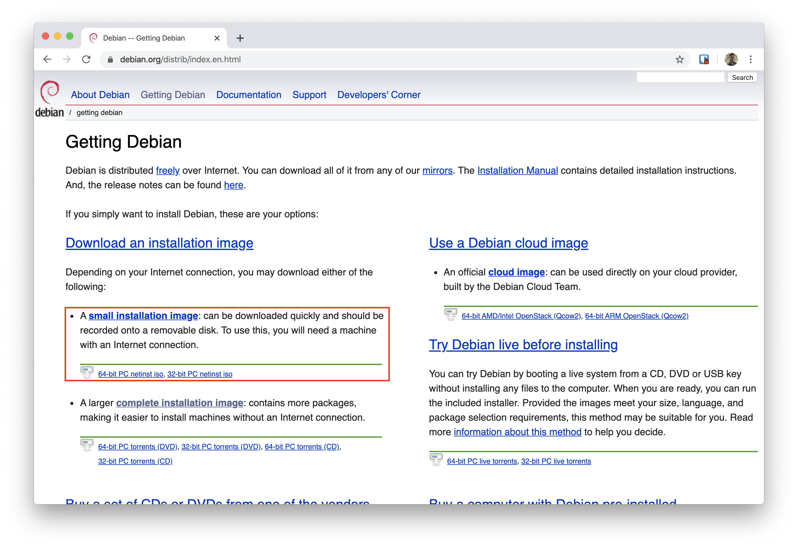
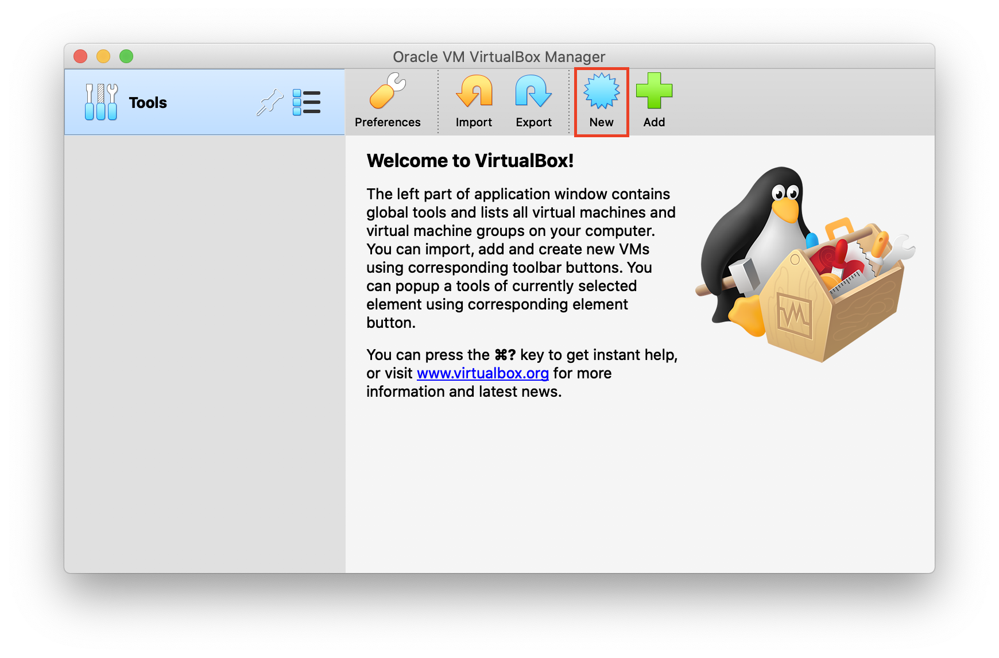
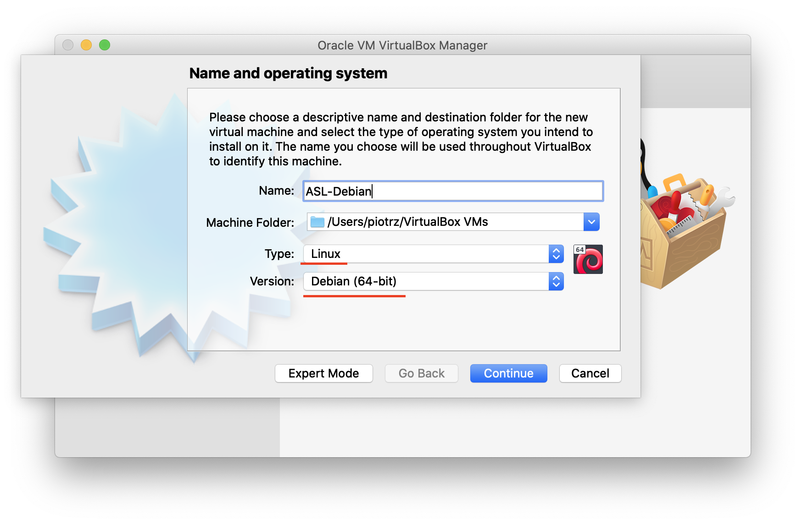
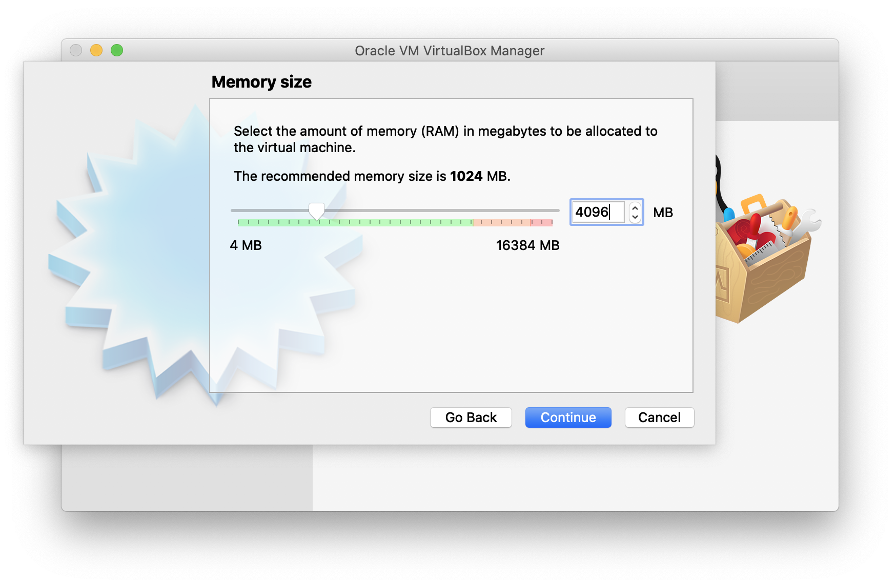
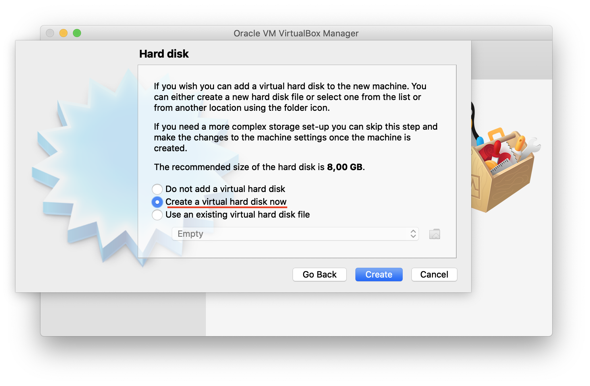
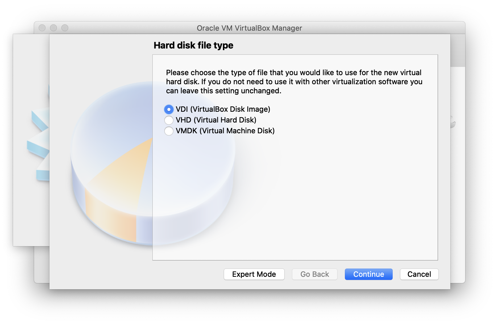
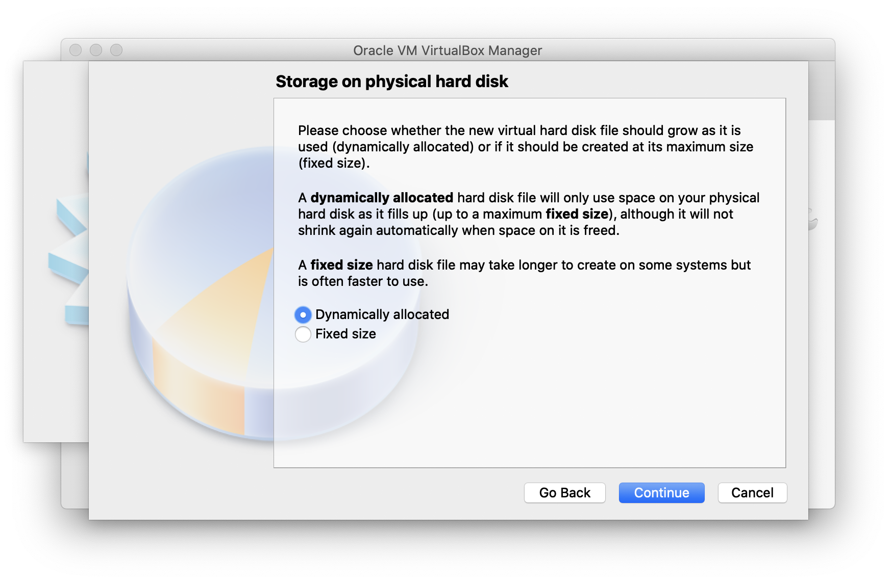
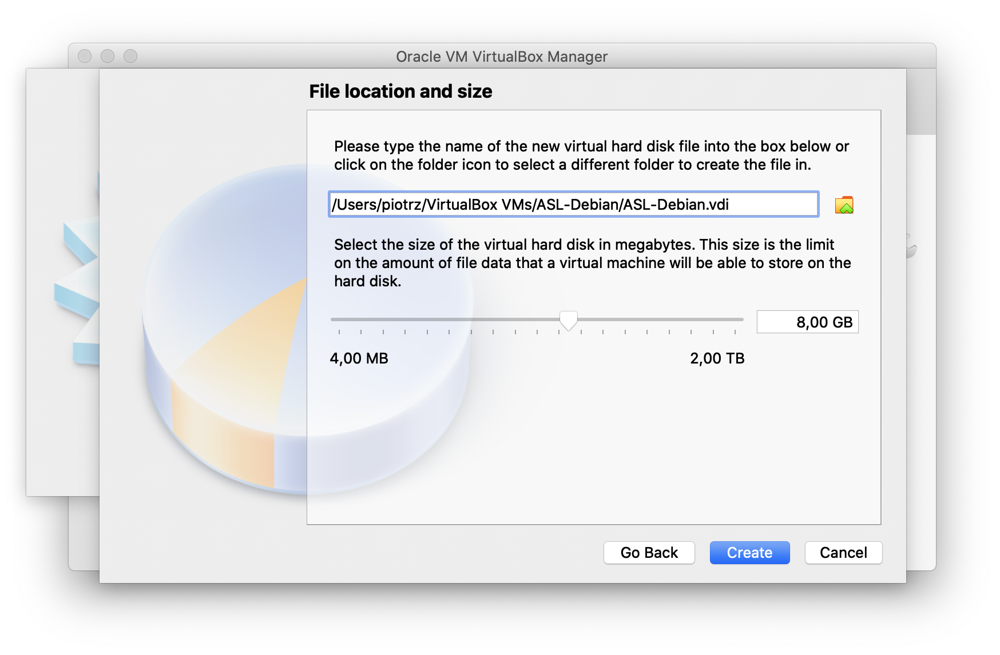
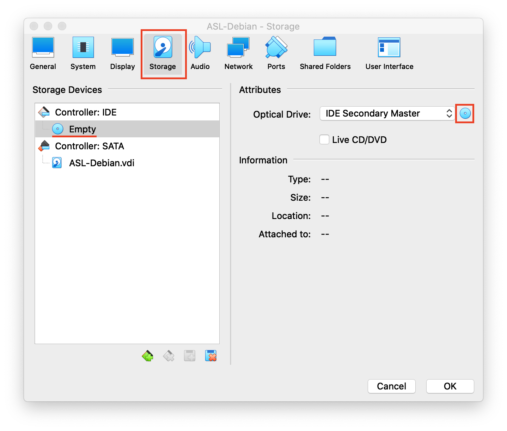
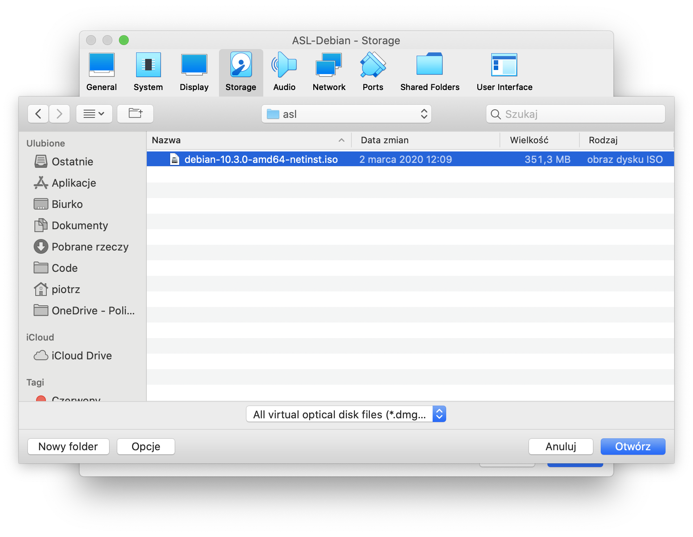

## Instalacja systemu Debian

  1. Pobieranie obrazu do instalacji internetowej
  
     [Strona internetowa](https://www.debian.org/distrib/)
     
     
     
  1. Konfiguracja VirtualBox
  
     [Strona internetowa](https://www.virtualbox.org/wiki/Downloads)
     
     Należy wybrać wersję odpowiednią dla danego systemu operacyjnego.
     
     a.  Utwórz nową maszynę wirtualną:
     
     
     
     
     
     
     
     
     
     
     
     
     
     
     
     
     
     
     
     Wybierz **choose a disk file** oraz znajdź plik z Debianem. Kliknij `OK`.
     
     
