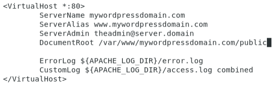

Konfiguracja i zarządzanie serwerm www. Systemy zarządzania treścią(CMS)
========================================================================

## Zadania

1. **Konfiguracja Apache**

   a. Zainstaluj serwer www używając polecenia (wykonaj to polecenie z konta root, bądź użyj polecenia sudo, jeśli Twój użytkownik należy do odpowiedniej grupy):

      ```console
      # apt install apache2
      ```
    
   b. Sprawdź czy po wpisaniu w pasku adresu przeglądarki “localhost” zobaczysz stronę powitalną *Apache*. **Zamieść zrzut ekranu w raporcie**.

   c. Sprawdź status usługi poleceniem

      ```console
      $ systemctl status apache2
      ```

      **Zamieść zrzut ekranu w raporcie.**

   d. Strona powitalna Apache (dostępna domyślnie w przeglądarce pod adresem localhost) przedstawia informacje o plikach konfiguracyjnych serwera. Przejrzyj domyślną konfigurację serwera Apache zawartą w pliku `/etc/apache2/apache2.conf`. Spróbuj na jego podstawie wywnioskować w jakim katalogu powinny zostać umieszczone pliki Twojej witryny, które Apache ma zaprezentować użytkownikowi.

2. **Witryna statyczna**

   a. Utwórz katalog, w którym umieścisz swoją witrynę:
      
      ```console
      # mkdir -p /var/www/myfirstdomain.com/public
      ```
   
   b. Dla utworzonego katalogu wraz z podkatalogami ustaw uprawnienia dla Twojego użytkownika (zastąp `youruser`):

      ```console
      # chown -R youruser:youruser /var/www/myfirstdomain.com

      # chmod 755 /var/www/myfirstdomain.com
      ```

   c. W katalogu `public` utwórz plik `index.html` z dowolną zawartością, która zostanie wyświetlona przez przeglądarkę.

   d. Uruchom przygotowaną witryne. W tym celu, utwórz w katalogu `/etc/apache2/sites-available` plik `myfirstdomain.com.conf` (lub skopiuj w to miejsce plik `000-default.conf`) i wprowadź następującą zawartość:

      ```
      <VirtualHost *:80>
      ServerName myfirstdomain.com
      ServerAlias www.myfirstdomain.com
      DocumentRoot /var/www/myfirstdomain.com/public
      ServerAdmin theadmin@server.domain
      ErrorLog ${APACHE_LOG_DIR}/error.log
      CustomLog ${APACHE_LOG_DIR}/access.log combined
      </VirtualHost>
      ```
   
   e. Wyłącz domyślną stronę Apache i włącz utworzoną witrynę, a następnie zrestartuj serwer:

      ```console
      # a2ensite myfirstdomain.com.conf

      # a2dissite 000-default.conf

      # systemctl restart apache2
      ```

   f. Odwiedź stronę `localhost` - powinna się tam pojawić strona z pliku `index.html`. **Zamieść jej zrzut ekranu w raporcie.**

   g. Używając instrukcji powyżej spróbuj uruchomić drugą witrynę, która będzie dostępna pod adresem localhost:14156. Oprócz innych zmian (wywnioskuj jakich), konieczne jest dodanie linijki `Listen 14156` w pliku konfiguracyjnym witryny w 
   `/etc/apache2/...`

3. **Przekierowanie**

   > W niektórych przypadkach konieczne jest przekierowanie zapytania o witrynę do innej witryny. Dzieje się tak w sytuacjach, kiedy część lub całość witryny została przeniesiona. W takiej sytuacji serwer zamiast zwrócić kod HTTP 200 OK zwraca kod 301 lub 302, czyli stałe lub tymczasowe przekierowanie.

   a. Aby włączyć przekierowanie, w pliku `/etc/apache2/sites-available/myfirstdomain.com.conf` dodaj linijkę: `Redirect / http://example.com`

   b. Zrestartuj usługę apache.

   c. Uruchom przeglądarkę, włącz narzędzia developerskie (F12), a następnie przełącz na zakładkę Network. Wpisz w przeglądarce adres localhost i zaobserwuj co się wydarzyło, powinieneś zobaczyć następujący rezultat:

      

   d. Zwróć uwagę, że przekierowanie jest tymczasowe. Aby przekierowanie było stałe, należy poprawić poprzednią linijkę na `Redirect 301 / http://example.com`

   e. Zrestartuj serwerj i sprawdź wynik w przeglądarce.

      

   f. Dla bardziej zaawansowanych przekierowań (np. Tylko wybrane podstrony, tylko strony o określonej nazwie itp.) zalecane jest użycie dodatku mod_rewrite. Przykładowe wykorzystanie można znaleźć [[TUTAJ]](https://www.digitalocean.com/community/tutorials/how-to-set-up-mod_rewrite).

   g. Po przekierowaniu należy pamiętać o wykasowaniu cache przeglądarki, w przeciwnym wypadku wykonanie kolejnych kroków może powodować trudności

4. **Hasło dostępu**

   > Istnieją sytuacje, w których chcielibyśmy ograniczyć dostęp do niektórych stron tak, aby użytkownik musiał podać hasło dostępu. Dodamy teraz takie ograniczenie do naszej strony.

   a. Zmodyfikuj plik `/etc/apache2/sites-available/myfirstdomain.com.conf` dodając następujące linijki (poniżej linii `CustomLog ...`, a przed tagiem zamykającym `</VirtualHost>`); pamiętaj aby usunąć przekierowanie:

      ```
      <Directory "/var/www/myfirstdomain.com/public">
      AuthType Basic
      AuthName "You cannot pass unless you have a pass"
      AuthUserFile "/usr/local/apache/passwd/passwords"
      Require valid-user
      </Directory>
      ```
  
   b. Konieczne jest także utworzenie pliku z którego apache skorzysta w celu uwierzytelnienia; można to zrobić poleceniem:
    
      ```console
      # htpasswd -c /usr/local/apache/passwd/passwords stud
      ```

      Aby ta komenda zadziałała katalog `/usr/local/apache/passwd/` musi istnieć.

   c. Zrestartuj serwer apache, odśwież stronę localhost (jeśli przeglądarka zapisała sobie poprzednią stronę, może zaistnieć konieczność usunięcia plików cache przeglądarki). **Zamieść zrzut ekranu z pytaniem przeglądarki o autoryzację.**

   d. Warto zwrócić uwagę na fakt, że nie jest to bezpieczna forma uwierzytelniania, ponieważ każdy kto przechwyci nasz ruch sieciowy w momencie wysyłania danych może odczytać nasze hasło. Samo hasło można zobaczyć w narzędziach developerskich przeglądarki, dokładniej w nagłówkach (hasło jest zakodowane w base64).

      

5. **Uwierzytelnianie *SSL/TLS***

   > Aby połączenie było bezpieczne, można rozważyć opcję uwierzytelniania z użyciem *Http Digest* `(jest to bezpieczniejsza wersja niż Basic, ale nadal nie jest ona całkowicie pozbawiona wad i luk bezpieczeństwa). Bezpieczeństwo połączenia może zapewnić także wykorzystanie protokołu *SSL/TLS*, którego uruchomieniem zajmiemy się teraz.

   > Należy zwrócić uwagę, że w środowiskach produkcyjnych certyfikat powinien zostać podpisany przez tzw. zaufaną organizację, w przeciwnym wypadku przeglądarka nie będzie mogła zweryfikować wiarygodności certyfikatu. Mimo tego, połączenie nadal będzie zaszyfrowane. Dodatkowo podczas tworzenia certyfikatu należy podać odpowiednią nazwę domeny, ponieważ to także jest weryfikowane. Dla celów ćwiczenia nie jest istotne jakie dane zostaną wpisane podczas tworzenia certyfikatu, nie będziemy też zajmować się podpisywaniem i uwierzytelnianiem naszych certyfikatów.
   
   a. W pierwszej kolejności należy wygenerować odpowiednie certyfikaty. Odbywać się to będzie analogicznie do konfiguracji `sftp` z poprzedniego ćwiczcenia. Aby wygenerować certyfikat, przygotuj katalog, w którym zostanie on umieszczony. Może to być dowolne miejsce, np. `/etc/apache2/ssl`.

      ```console
      # mkdir /etc/apache2/ssl

      # openssl req -x509 -nodes -days 1095 -newkey rsa:2048 -out /etc/apache2/ssl/server.crt -keyout /etc/apache2/ssl/server.key
      ```

   b. Uzyskaliśmy dwa pliki: certyfikat: `server.crt` oraz klucz `server.key`.

   c. Włącz moduł ssl dla serwera apache:

      ```console
      # a2enmod ssl
      ```

   d. Zmodyfikuj plik `myfirstdomain.com.conf` dodając następujące linie:

      ```
      <VirtualHost *:443>
      SSLEngine on
      SSLCertificateFile /etc/apache2/ssl/server.crt
      SSLCertificateKeyFile /etc/apache2/ssl/server.key
      ```

      Po modyfikacjach całość pliku powinna wyglądać następujaco:

      

   e. Zrestartuj serwer apache, a następnie odwiedź stronę `https://localhost` (konieczne będzie dodanie wyjątku bezpieczeństwa na wirtualnej maszynie). **Zamieść zrzut ekranu z pytaniem przeglądarki o autoryzację.**
      

6. **Wordpress**

   a. Wyłącz wszystkie używane dotychczas domeny (ich listę możesz sprawdzić listując zawartość katalogu `/etc/apache2/sites-enabled`):

      ```console
      # a2dissite myfirstdomain.com

      .. itd. dla pozostałych
      ```
  
   b. Utwórz nową witrynę:

      ```console
      # mkdir -p /var/www/mywordpressdomain.com/public
      # chmod 755 /var/www/mywordpressdomain.com
      ```

   c. Dodaj plik `/var/www/mywordpressdomain.com/public/index.php` o zawartości:
   
      ```php
      <?php phpinfo(); ?>
      ```

   d. Zainstaluj `php` i `mysql` (w zależności od repozytorium może istnieć konieczność wyboru innej wersji php, można to sprawdzić poprzez `apt-cache search php`):

      ```console
      # apt update

      # apt install mariadb-client mariadb-server

      # apt install php7.3 php7.3-mysql

      # apt install libapache2-mod-php7.3
      ```

   e. W katalogu `/etc/apache2/sites-available` utwórz plik `mywordpressdomain.com.conf` o zawartości:
  
      

   f. Uruchom utworzoną witrynę i zrestartuj serwer Apache:

      ```console
      # a2ensite mywordpressdomain.com.conf

      # systemctl restart apache2
      ```
  
   g. Odwiedź stronę `localhost` - powinna się tam znajdować strona potwierdzająca, że serwer Apache obsługuje strony php. **Zamieść zrzut ekranu tej strony w raporcie.**

   h. Jeśli wszystko do tej pory przebiegło pomyślnie, w kolejnych krokach należy przygotować bazę danych dla Wordpress. Aby to zrobić należy wykonać następujące komendy (Zwróć uwagę na użytkownika i hasło, będzie później potrzebne):

      ```console
      # mysql -u root -p
      ```

      

   i. W kolejnych krokach należy ściągnąć *Wordpress*, rozpakować go i zmodyfikować wcześniej utworzoną witrynę, żeby po wejśćiu na adres `localhost` uruchomił się *Wordpress*:

      ```console
      $ cd ~/Downloads

      $ wget https://wordpress.org/latest.tar.gz

      $ tar xpf latest.tar.gz

      # cp -r wordpress/ /var/www/mywordpressdomain.com/public
      ```

   j. W pliku `/etc/apache2/sites-available/mywordpressdomain.com.conf` zmodyfikuj `DocumentRoot`, aby wskazywał przekopiowany katalog wordpress (`/var/www/mywordpressdomain.com/public/wordpress`)

   k. Usuń niepotrzebny już plik `index.php` z `/var/www/mywordpressdomain.com/public/`.

   l. Zmodyfikuj uprawnienia do katalogu z witryną wordpress:

      ```console
      # chown -R www-data:www-data /var/www/mywordpressdomain.com

      # find /var/www/mywordpressdomain.com -type d -exec chmod 755 {} \;

      # find /var/www/mywordpressdomain.com -type f -exec chmod 644 {} \;
      ```
  
   m. Zrestartuj serwer Apache.

   n. Po uruchomieniu strony `localhost` powinien uruchomić się instalator Wordpress. **Zamieść w raporcie zrzut ekranu z przeglądarki z ekranu następującego po wyborze języka.**

   o. Skonfiguruj Wordpressa zgodnie z wcześniejszymi ustawieniami (patrz zrzuty ekranu):

      

      

      **Zamieść w raporcie zrzut ekranu z końcowego ekranu konfiguracji (*Success!*) oraz z głównego dashboardu Wordpressa po zalogowaniu.**

## Literatura:

 * slajdy z wykładu nr 12
 * materiały online dotyczące instalacji i konfiguracji serwera www oraz instalacji Wordpress