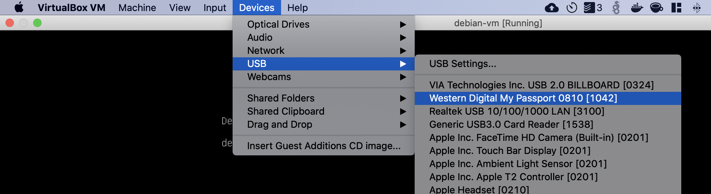
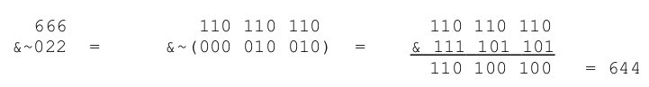

Zarządzanie dyskami i systemem plikowym
=======================================

## Zadania:

1. Za pomocą komendy `df` sprawdź dostępne wolne miejsce na dysku. W jakich jednostkach wyświetlana jest pamięć? Podaj komendę, która pozwoli na wyświetlenie tej informacji w czytelny sposób (podpowiedź: sprawdź manual).

2. Podłącz pendrive albo inne urządzenie USB do komputera. Jeśli używasz maszyny wirtualnej musisz przy tym podłączyć do niej urządzenie, np. dla VirtualBox:

   

   -  Sprawdź nazwę podłączonego urządzenia używając komendy `lsblk`, sprawdź też gdzie zostało zamontowane. Prześlij screenshot wyniku tej komendy. Jeżeli urządzenie nie zostało zamontowane - zrób to samemu.
   -  Odmontuj urządzenie za pomocą `umount`. Sprawdź wynik komendy `lsblk` i wyślij screenshot jej wyniku.
   -  Zamontuj ponownie urządzenie do folderu `/home/<nazwa-użytkownika/pendrive/`
   -  Sprawdź rozmiar wszystkich plików znajdujących się w folderze `/home/<nazwa-użytkownika/`, używając komendy `du`. Jakiej komendy użyjesz, by wyświetlić rozmiar wszystkich folderów znajdujących się w tym folderze (bez wyświetlania ich zawartości)?

3. Utwórz dwa skrypty bashowe: `appV1.sh` (który po wywołaniu wyświetla `"app v1"`) oraz `appV2.sh` (który po wywołaniu wyświetla `"app v2"`) i umieść w Twoim katalogu domowym.
   -  Utwórz dowiązanie symboliczne `app` wskazujące na `appV1.sh` i wywołaj aplikację.
   -  Zmodyfikuj link `app` tak, aby wskazywał na `appV2.sh`. Wykonaj zrzut ekranu długiego listingu, pokazującego to dowiązanie.
   -  Stwórz folder `scripts` w katalogu domowym i przenieś do niego oba skrypty (bez linku `app`). Utwórz link symboliczny do tego folderu i nazwij go `task3`. Wykonaj zrzut ekranu długiego listingu, pokazującego to dowiązanie.

4. Konfiguracja zezwoleń dla plików:
   -  Utwórz dwóch użytkowników: `user1` oraz `user2`.
   -  Zaloguj się na użytkownika `user1` (polecenie `su`) i przejdź do katalogu `/tmp`. Utwórz w nim dwa pliki: `group.txt` oraz `other.txt` i umieść w każdym z nich dowolny tekst.
   -  Przełącz się na użytkownika `user2` i sprawdź możliwość modyfikacji zawartości obu plików (np. używając nano).
   -  Na koncie `root` nadaj innym użytkownikom możliwość zapisywania do pliku `other` (polecenie `chmod`).
   -  Zmień grupę pliku `group` na `user2` (polecenie `chown`) oraz nadaj członkom tej grupy prawo do zapisu w pliku (`chmod`).
   -  Wyświetl długi listing dla obu plików i wykonaj zrzut ekranu. Zadbaj o to, by wyświetliły się tam tylko te dwa pliki.
   -  Zaloguj się jako `user2` i spróbuj jeszcze raz zmodyfikować oba pliki.
   -  Utwórz katalog `user2dir` i nadaj mu uprawnienia, które uniemożliwią innym przeglądanie zawartości tego katalogu. Jakiej komendy użyjesz?

5. Maska użytkownika 

   > Domyślnie pliki mają uprawnienia 666, a katalogi 777. Jeżeli utworzymy nowy plik to zauważymy, że otrzymał on uprawnienia 644, a nowy folder 755. Uprawnienia te są wyznaczane na podstawie bitowego iloczynu uprawnień z zanegowaną wartością maski (domyślna wartość 022).
   > 

   -  Wyświetl wartość maski za pomocą polecenia `umask`.
   -  Zmień wartość maski na `007`.
   -  Utwórz nowy plik i nowy folder. Jakie uprawnienia zostaną im nadane? Co one oznaczają?

6. *Sticky bit*

   -  Zaloguj się na użytkownika `user1`. Utwórz w katalogu `/tmp` folder `sticky` i nadaj mu uprawnienia `1777`. W katalogu utwórz pusty plik `empty` i nadaj mu uprawnienia `777`.
   -  Przełącz się na użytkownika `user2`. Czy możesz modyfikować plik `empty`. Czy możesz zmienić jego nazwę? Czy możesz go usunąć?

7. SUID i SGID
   -  Zaloguj się jako `user1` i wykonaj polecenia `whoami` i `groups`.
   -  Jako `root` wykonaj polecenia `chmod u+s /usr/bin/whoami` oraz `chmod g+s /usr/bin/groups`. Wyświetl długi listing dla tych dwóch poleceń i wykonaj zrzut ekranu.
   -  Wykonaj ponownie te polecenia jako `user1`. Co się zmieniło? Wykonaj zrzut ekranu.
   -  Usuń bity SUID i SGID z `whoami` i `groups`.

8. ACL
   -  Za pomocą `tune2fs` sprawdź czy ACL jest włączony (podpowiedź: infrmacja na ten temat znajduje się w linii `"Default mount options"`). Spróbuj użyć `grep` by wybrać tylko potrzebną linię.
   -  Jako root stwórz plik z prawem do  odczytu dla innych użytkowników, a następnie za pomocą `setfacl` odbierz użytkownikowi `user1` możliwość odczytu. Sprawdź prawa do pliku używając długiego listingu i `getfacl`.
   -  Zaloguj się na użytkownika `user1` i spróbuj odczytać plik, to samo powtórz dla użytkownika `user2`.
   -  Jako `user1` utwórz katalog `aclDir` i nadaj mu uprawnienia 744. Wykorzystując ACL nadaj grupie `user2` dodatkowo prawo do zapisu w tym katalogu. Czy `user2` będzie mógł stworzyć plik w tym folderze?

## Literatura:
 * **`man`**: 
   *  `id` - wyświetla identyfikator obecnego użytkownika,
   *  `chmod` - modyfikuje zezwolenia dostępu do pliku,
   *  `umask` - modyfikuje ograniczenie dostępu do pliku (maska użytkownika),
   *  `su` - zmiana użytkownika,
   *  `sudo` - wykonanie komendy jako inny użytkownik,
   *  `chown` - zmienia właściciela pliku,
   *  `chgrp` - zmienia grupę pliku,
   *  `fdisk` - zarządzanie partycjami,
   *  `mkfs` - sformatowanie partycji do określonego systemu plików,
   *  `df` - sprawdza stanu zajętości partycji,
   *  `du` - sprawdza wielkość plików
   *  `ln` - tworzy linki symboliczne
   *  `blkid` - wyświetlanie identyfikatorów partycji (UUID),
   *  `mount` - montowanie partycji do folderów
   *  `setfacl` - ustawienie listy ACL
   *  `getfacl` - odczyt pliku ACL
 * slajdy z wykładu nr 4
 * [The Linux Command Line](http://linuxcommand.org/) - [link do książki](https://sourceforge.net/projects/linuxcommand/files/TLCL/19.01/TLCL-19.01.pdf/download):
   *  rozdział 3 - *Exploring the System*
   *  rozdział 4 - zarządzanie plikami i folderami
   *  rozdział 9 - uprawnienia
   *  [TLDP](http://www.tldp.org/HOWTO/Filesystems-HOWTO.html)
   *  [ACLs](https://help.ubuntu.com/community/FilePermissionsACLs)