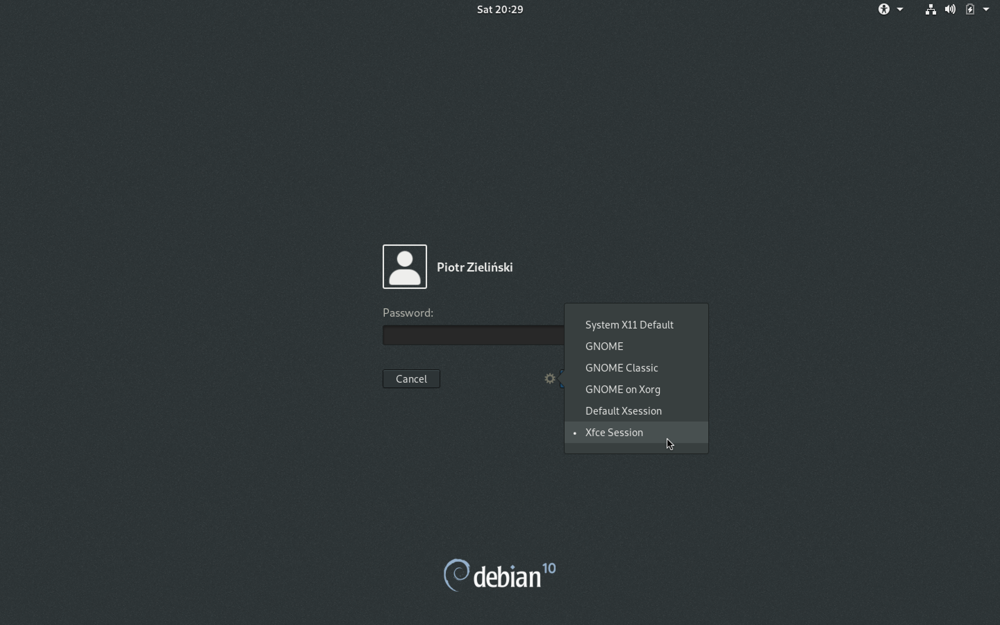

Aktualizacja systemu, instalacja, aktualizacja i deinstalacja dodatkowego oprogramowania z wykorzystaniem pakietów instalacyjnych i repozytoriów oprogramowania. Konfigurowanie drukowania w środowisku Linux. Środowisko graficzne - X Window
================================================================================================================================================================

Do instalacji oprogramowania przy użyciu shella konieczne jest podniesienie uprawnień:
  *  instalacja jako root

     ```bash
     su -
     ROOT_COMMAND
     ```

  *  wykorzystanie grupy `sudoers`

     ```bash
     su -
     usermod -aG sudo USERNAME
     reboot
     ...
     sudo ROOT_COMMAND
     ```

## Zadania:

1. Wykonaj aktualizację wszystkich pakietów zainstalowanych w systemie. Pokaż screenshot wykonania polecenia `apt-get update`.

2. Zainstaluj odtwarzacz VLC używając APT:
   -  zaktualizuj repozytoria
   -  wyszukaj `vlc` używając `apt-cache search`
   -  zainstaluj pakiet i spróbuj uruchomić odtwarzacz
   -  pokaż screenshot uruchomionego programu

3. Odinstaluj pakiet `vlc` wraz z jego plikami konfiguracyjnymi. Pokaż screenshot wykonanego polecenia.

4. Zainstaluj Google Chrome:
   -  Google Chrome nie znajduje się w repozytorium Debiana. Należy pobrać paczkę `.deb` - np. z `https://dl.google.com/linux/direct/google-chrome-stable_current_amd64.deb`, używając polecenia `wget`
   -  Zainstaluj pakiet używając `dpkg`. Pokaż screen z wykonanego polecenia. Uwaga: jeżeli `dpkg` poinformuje o braku zależności, po wykonaniu polecenia należy wywołać `sudo apt-get install -f`, co zainstaluje brakujące zależności, a następnie ponowić instalację.

5. Zainstaluj menadżera pakietów `snap` (w apt pakiet nazywa się `snapd`). Następnie, używając `snap` zainstaluj `chromium` - projekt open-source, na bazie którego zbudowano Google Chrome. Pokaż screen z wykonanego polecenia.

6. Otwórz interfejs CUPS (adres: `http://localhost:631`).
   -  Wyświetl dostępne drukarki (z górnej belki wybierz `Printers`.
   -  Zainstaluj drukarkę PDF (pakiet `printer-driver-cups-pdf`). Sprawdź, czy drukarka pojawiła się na liście drukarek w CUPS.
   -  Wywołaj polecenie: `ls / | pr -4 -w 90 -l 88 | less` by zobaczyć, jak `pr` przygotuje plik do druku (4 kolumny, 90 znaków w linii, 88 linii na stronę)
   -  Wywołaj polecenie: `ls / | pr -4 -w 90 -l 88 | lp -o page-left=36 -o cpi=12 -o lpi=8` (drukuje przygotowany plik, ustawiając lewy margines na 36 punktów, z ustawieniami: 12 znaków na cal i 8 linii na cal). Pokaż zrzut ekranu wydrukowanego pliku (powinien się znaleźć w folderze PDF w katalogu domowym).

7. Zapoznaj się z dostępnymi środowiskami graficznymi (domyślnie zainstalowany jest Gnome): [link](https://wiki.debian.org/DesktopEnvironment#Desktop_Environment)
   -  Wybierz jedno (inne niż Gnome) i zainstaluj w maszynie wirtualnej.
   -  Zaloguj się do nowego środowiska graficznego i pokaż zrzut ekranu (jeżeli nie zmieniasz menedżera logowania, to w GDM3 (domyślnym menedżerze logowania Gnome) możesz wybrać menedżera przy wpisywaniu hasła. Uwaga: czasem może być konieczne ponowne uruchomienie komputera po instalacji DE)

      

## Literatura:
 * **`man`**: 
   *  `apt-get`:
      *  `apt-get update` - aktualizacja informacji z repozytoriów (wykonywane przed instalacją paczki, aktualizacją lub dodaniem repozytorium)
      *  `apt-get upgrade` - aktualizacja zainstalowanych pakietów
      *  `apt-get install PACKAGE` - instalacja pakietu `PACKAGE`
      *  `apt-cache search STRING` - wyszukiwanie pakietu zawierającego `STRING` w metadanych
      *  `apt-get remove PACKAGE` - usuwanie pakietu `PACKAGE` (nie usuwa plików pakietu, np. plików konfiguracyjnych)
      *  `apt-get purge PACKAGE` - usuwanie pakietu `PACKAGE` i plików
      *  `apt-get autoremove` - usuwanie pozostałych po usunięciu inny pakietów zależności, nie wykorzystywanych przez zainstalowane pakiety
      *  `apt-cache show PACKAGE` - wyświetlanie nazwy oraz opisu pakietu `PACKAGE`
   *  `dpkg -i PACKAGE` - instalacja pakietu w postaci pliku `*.deb` (dla Debiana)
   *  `apt`, `aptitude` (łączą funkcjonalności `apt-get` i `apt-cache`, dodatkowo zawierają paski postępu, kolory)
   *  `snap`, `flatpak` (*application stores*, zawierają aplikacje wraz z zależnościami, odizolowanymi od systemu)
   *  `pr` - zamiana pliku tekstowego do druku
   *  `lp` - drukowanie pliku
   *  `lpstat` - wyświetlenie informacji o drukarce
   *  `lpq` - wyświetlanie kolejkę drukowania
   *  `lprm` - anulowanie zadania druku

 * slajdy z wykładu nr 6 i 7
 * [The Linux Command Line](http://linuxcommand.org/) - [link do książki](https://sourceforge.net/projects/linuxcommand/files/TLCL/19.01/TLCL-19.01.pdf/download):
   *  rozdział 14 - zarządzanie pakietami
   *  rozdział 22 - drukowanie
