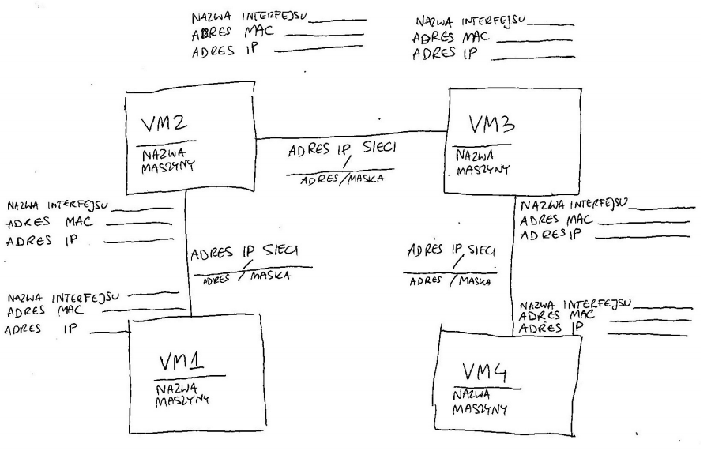

Zarządzanie połączeniami sieciowymi. Routing
============================================

## Wymagania wstępne:

 * **Virtualbox** 

   > uwaga dla Windowsa: sprawdź czy w oknie linii poleceń CMD możesz uruchomić polecenie `vboxmanage`, jeśli nie - otwórz okno "*Edytuj zmienne środowiskowe systemu*" i do zmiennej środowiskowej PATH dodaj katalog w którym został zainstalowany VirtualBox (zwykle jest to `C:\Program Files\Oracle\VirtualBox\`)

 * Pobierz i rozpakuj pliki laboratoryjne: [link](https://ip245.io.pwr.edu.pl/downloads/routinglab.zip) (plik ZIP, ok 270MB)

 * Otwórz okno linii poleceń (Term/CMD) i przejdź do folderu *routinglab*

 * Uruchom skrypt *cook-vms* aby utworzyć cztery maszyny wirtualne:

   * Wybierz wersję skryptu przeznaczoną dla twojego systemu (Linux: `cook-vms.sh`, Windows `cook-vms.cmd`)

   * W aplikacji zarządzającej (Oracle VirtualBox lub Hyper-V Manager) powinny pojawić się cztery maszyny wirtualne VM1-VM4.

   * Jeżeli w trakcie laboratorium coś pójdzie nie tak, ponowne uruchomienie `cook-vms` spowoduje skasowanie i utworzenie wszystkich maszyn na nowo.

 * Uruchom maszyny poleceniem *start-vms*. Poczekaj aż wszystkie maszyny uruchomią się i zrestartują w celu przeprowadzenia pełnej konfiguracji.

   * login: `debian`

   * hasło: `password`

   * przejście na konto administratora: `sudo -i`

> W raporcie umieść tylko te elementy, przy których zostało to wyraźnie zaznaczone.

## Zadania:

1. Zapoznanie się ze środowiskiem

   > Maszyny przygotowane do pracy w tym laboratorium zostały skonfigurowane w następujący sposób: każda maszyna ma zawsze adres IP hosta w postaci 10X, czyli maszyna VM1 ma adres hosta 101, VM2 -- 102, itd.. Adres IP sieci wskazuje które maszyny łączy: sieć między VM1 i VM2 ma adres 10.1.2.0/24, VM2 i VM3 -- 10.2.3.0/24 itd.. Przedostatnia cyfra adresu MAC interfejsu sieciowego wskazuje na numer maszyny, zaś ostatnia -- z którą maszyną się łączy, np. karta sieciowa maszyny VM1 ma adres `52:54:00:00:00:12`.

   a. W każdej z maszyn uruchom polecenie `ip ad`. Zobacz jakie interfejsy sieciowe (karty sieciowe) w niej zainstalowano.

   b. Wypełnij i **załącz do raportu** mapę sieci:

     

   c. W maszynie VM2 uruchom polecenie  `ip route`. Tabela routingu zawiera teraz tylko trasy do sieci podłączonych bezpośrednio do maszyny VM2: 10.1.2.0/24 (przez interfejs eth0) i 10.2.3.0/24 (przez interfejs eth1).

   d. Wykonaj polecenia `ping 10.1.2.101` i `ping 10.2.3.103` aby sprawdzić czy maszyna VM2 ma połączenie z maszynami VM1 i VM3.

     > Polecenie `ping` wysyła pakiet do komputera docelowego, a usługa działająca na komputerze docelowym odbiera go i odsyła odpowiedź do nadawcy. 

   e. Wykonaj polecenie `traceroute 10.1.2.101` aby zobaczyć którędy jest wędruje pakiet z maszyny VM2 do VM1.

     > Polecenie `traceroute` wielokrotnie wysyła pakiet `ping` do komputera docelowego, za każdym razem zwiększając liczbę przeskakiwanych routerów o 1. W ten sposób tworzy się lista routerów przez które przechodzi pakiet w drodze do komputera docelowego.

   f. Wykonaj polecenia `ping` i `traceroute` do adresu którego VM2 nie zna - np. 8.8.8.8. Jaki komunikat o błędzie jest wyświetlany? **Zamieść jego zrzut ekranu w raporcie**.

   g. W maszynie VM1 wykonaj polecenie `ip route`.

     > Zwróć uwagę, że trasa do podsieci podłączonej bezpośrednio (10.1.2.0/24) jest podobna jak w VM2. Maszyna VM1 ma również zdefiniowaną tzw. trasę domyślną (inaczej: trasę ostatniej szansy lub *Default Gateway*). Trasą domyślną (*default* lub 0.0.0.0) są wysyłane pakiety nie pasujące do innych tras w tabeli routingu. Pakiety wysyłane trasą domyślną są przekazywane bezpośrednio do komputera oznaczonego jako *gateway* (pole *via*). 

   h. Wykonaj polecenia `ping 10.1.2.102` i `traceroute 10.1.2.102` aby przetestować połączenie z maszyną VM2.

   i. Przetestuj działanie poleceń `ping 8.8.8.8` i `traceroute 8.8.8.8`. Jaki komunikat błędu pojawia się teraz? Który komputer sygnalizuje że host 8.8.8.8 jest nieosiągalny? **Zamieść odpowiedź oraz zrzut ekranu w raporcie**.

      > Maszyny VM2 i VM3 pełnią funkcję routerów, więc wysyłają pakiety tylko do sieci o których coś wiedzą (z tabeli routingu). Maszyny VM1 i VM4 pełnią funkcję komputerów osobistych, więc wszystkie dane do innych sieci wysyłają do najbliższego routera (bramy domyślnej lub *Default Gateway*)

## Literatura:
 * slajdy z wykładu nr 8
 * [tutorial iptables](https://www.hostinger.com/tutorials/iptables-tutorial)
