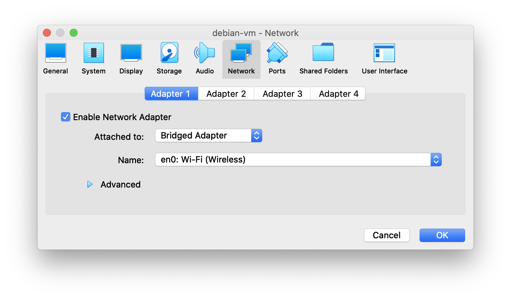

Zapory sieciowe (firewall) i sterowanie ruchem sieciowym
========================================================

## Zadania:

> Zadanie 1. wykonaj wykorzystując maszyny wirtualne z poprzedniej listy (routing). Pozostałe wykonaj używając Twojej maszyny wirtualnej ze środowiskiem graficznym. Niezalecane jest wykonywanie ćwiczeń dotyczących firewalla w systemie, z którego korzystasz na codzień.

> Skonfiguruj sieć swojej maszyny wirtualnej by móc połączyć się z nią z poziomu hosta. W tym celu w ustawieniach maszyny wybierz *Sieć*/*Network* i skonfiguruj *Adapter 2* w tryb *Bridge*, wybierając jako nazwę połączenie kablowe.

  

1. **`iptables`**
   -  `iptables` powinien być już zainstalowany - gdyby nie był zainstaluj go poleceniem:

      ```console
      # apt-get update
      # apt-get install iptables
      ```

      > `iptables` składa się z tablic (*tables*), reguł (*chains*) oraz operacji na pakiecie (*targets*).

      > 4 typy tablic:
      > * *filter* (filtrowanie - najczęściej używane, domyślne)
      > * *mangle* (zmiana nagłówków pakietów)
      > * *nat* (zmiana źródłowych i docelowych adresów pakietów)
      > * *raw* (do analizy pakietów wynikających ze zmiany stanu firewalla

      > 5 typów reguł:
      > * *PREROUTING* (przy pojawieniu się na interfejsie - dla tablic *mangle* i *filter*)
      > * *INPUT* (przed podaniem pakietu do lokalnego procesu - dla tablic *mangle* i *filter*)
      > * *OUTPUT* (po utworzeniu pakietu przez proces - dla tablic *raw*, *mangle*, *nat* i *filter*)
      > * *FORWARD* (dla każdego pakietu przekierowanego przez hosta - dla tablic *mangle* i *filter*)
      > * *POSTROUTING* (przy opuszczaniu interfejsu przez pakiet - dla tablic *nat* i *mangle*)

      > 3 główne operacje na pakiecie:
      > * *ACCEPT* - przyjęcie pakietu
      > * *DROP* - odrzucenie pakietu (przy połączeniu z systemem wygląda to tak, jakby system nie istniał)
      > * *REJECT* - odrzucenie pakietu (przy połączeniu pojawia się komunikat *connection reset* dla TCP lub *destination host unreachable* dla UDP lub ICMP)

      

      Główne komendy `iptables`:

      * dodawanie reguły:

        ```console
        # iptables -A <chain> -i <interface> -p <protocol> -s <source> -dport <port> -j <target>
        ```

      * usuwanie reguły - zastąp `-A` przez `-D`

        ```console
        # iptables -D <chain> -i <interface> -p <protocol> -s <source> -dport <port> -j <target>
        ```

      * usuwanie wszystkich reguł

        ```console
        # iptables -F
        ```

      * usuwanie wszystkich reguł w chainie

        ```console
        # iptables -F <chain>
        ```

      * listowanie reguł

        ```console
        # iptables -L --line-numbers
        ```

        na tej podstawie można również usuwać reguły

        ```console
        # iptables -D <chain> <number>
        ```

      * zapisanie reguł, by były dostępne po ponownym uruchomieniu

        ```console
        # /sbin/iptables-save
        ```

      Inne reguły można znaleźć w tutorialu (sprawdź literaturę).

   a. Sprawdź status `iptables`:

      ```console
      # iptables -L -v
      ```

   b. Załóżmy, że chcielibyśmy ukryć przed maszyną VM4 router VM3, tzn. uniemożliwić pingowanie jego adresu oraz połączenie z nim przez `ssh`.

      - Na maszynie VM4 sprawdź połączenie z maszyną VM3 (`ping 10.3.4.103`) oraz spróbuj połączyć się używając [SSH](https://pl.wikipedia.org/wiki/Secure_Shell) (`ssh 10.3.4.103`).

        > na pytanie "*Are you sure you want to continue connecting (yes/no)*" wpisz `yes`. Aby wyjść z Secure Shell należy wpisać `exit` lub wykorzystać skrót klawiszowy `Ctrl+D`.

        > Pamiętaj o tym, że w zależności od sieci poszczególne maszyny mają inne adresy.

      - Zablokuj możliwość pingowania VM3 przez VM4; na maszynie VM3 wpisz komendę:

        ```console
        # iptables -I INPUT -p icmp -j DROP -i eth1
        ```

        > w ten sposób blokowany jest połączenie na interfejsie `eth1` (połączenie VM3 i VM4) dla protokołu `icmp` wykorzystywanego przez ping

      - Sprawdź możliwość pingowania VM3 z maszyn VM2 i VM4 (pierwsze powinno nadal działać, drugie - nie). **Umieść w raporcie zrzut ekranu z wywołania odpowiednich poleceń**

      - Zablokuj możliwość połączenia przez `ssh` z VM4 na VM3 (analogicznie do powyższych kroków - protokół `ssh`). **W raporcie umieść zrzuty ekranów z próby połączenia przez ssh z VM3.**

      - Zablokuj pingowanie i ssh z maszyny VM2. **Załącz zrzuty ekranów z prób pingowania i połączenia ssh z VM2 na VM3.**

      - Sprawdź, czy nadal możliwe jest pingowanie maszyny VM4 z VM1.
       

2. **`ufw`** i **`gufw`**
   
   -  Zainstaluj `ufw` i `gufw` poleceniem:

      ```console
      # apt-get update
      # apt-get install ufw gufw
      ```

   Główne komendy `ufw`:

   * aktywowanie ufw:

      ```console
      # ufw enable
      ```

   * deaktywowanie ufw:

      ```console
      # ufw disable
      ```

   * ponowne załadowanie reguł ufw:

      ```console
      # ufw reload
      ```

   * status ufw:

      ```console
      # ufw status verbose
      ```

   * usuwanie reguł ufw:

      ```console
      # ufw status numbered
      # ufw delete NUMBER
      ```

   Sprawdź również tutorial `ufw` z literatury.

   a. Aktywuj `ufw`. Sprawdź jego status. **Umieść zrzut ekranu w raporcie.**

   b. Sprawdź, czy możesz połączyć się ze swoją maszyną z jej poziomu używając ssh. Wykonaj polecenie `ssh 127.0.0.1`.

   c. Wykonaj polecenie:

   ```console
   # ufw deny from 127.0.0.1 to 127.0.0.1 port 22 proto ssh
   ```
   
   > 

3. **`firewalld`** i **`firewall-applet`**

   a. 

## Literatura:
 * **`man`**: 
   *  iptables
   *  ufw
 * slajdy z wykładu nr 9
 * [tutorial iptables](https://www.hostinger.com/tutorials/iptables-tutorial)
 * [tutorial ufw](https://help.ubuntu.com/community/UFW)