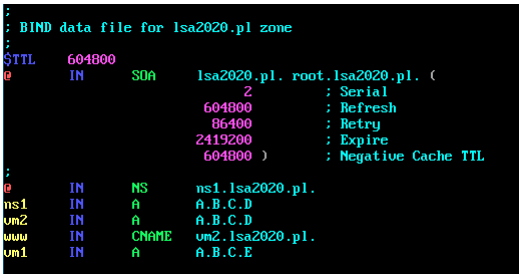
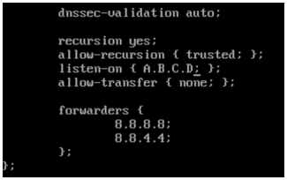
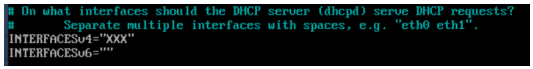
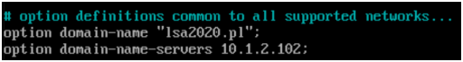
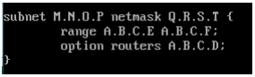
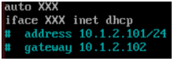

Konfiguracja i zarządzanie serwerami DHCP i DNS
===============================================

## Wymagania wstępne

1. Zadania wykonywane będą przy pomocy maszyn VM1 i VM2 stworzonych podczas listy zadań dot. routingu.

2. Dla przypomnienia: dane logowania to `debian`/`password`, uprawnienia podnosimy przy pomocy `sudo -i`.

3. Aby przywrócić maszyny do stanu początkowego, uruchom skrypt `cook-vms`.

4. Aby maszyna VM2 miała dostęp do Internetu, wykonaj polecenie:

   ```console
   vboxmanage modifyvm vm2 --nic3 nat
   ```

5. Uruchom maszyny z użyciem skryptu `start-vms`.

6. Aby udostępnić maszynie VM1 Internet przez VM2: sprawdź jak nazywa się nowa karta sieciowa podłączona do Internetu w maszynie VM2, a następnie odpowiednio skonfiguruj usługę iptables (zamień `eth2` na nazwę twojej karty):

   ```console
   debian@vm2:~$ sudo –i
   root@vm2:~# ip ad
   root@vm2:~# iptables -t nat -A POSTROUTING -o eth2 -j MASQUERADE
   ```

   Karta może nazywać się np. `eth2` lub `enp0s9`. Jeśli wszystko jest skonfigurowane poprawnie, to na maszynie VM1 powinno poprawnie działać polecenie: `ping 8.8.8.8`.

## Zadania

1. **Instalacja serwera DNS**

   > Domain Name Server (DNS) jest usługą tłumaczącą nazwy domenowe na adresy IP. 

   W tym zadaniu chcemy pozwolić w naszej sieci lokalnej (a więc VM1 i VM2) mogły posługiwać się czytelnymi nazwami domenowymi. Przykładową domenę nazwiemy `lsa2020.pl`, a maszyny będą mieć odpowiednie adresy `vm1.lsa2020.pl` i `vm2.lsa2020.pl`. Maszyna VM2 będzie serwerem DNS.

   a. Na maszynie VM2 zainstaluj potrzebne pakiety:
      
      ```console
      # apt update

      # apt install -y bind9 bind9utils bind9-doc dnsutils
      ```

   b. Zmodyfikuj plik `/etc/bind/named.conf.local` i wskaż w nim serwerowi `bind` gdzie znajduje się plik konfiguracyjny strefy DNS `lsa2020.pl`:

      ```
      zone "lsa2020.pl" {
          type master;
          file "/etc/bind/db.lsa2020.pl";
      };
      ```
    
   c. Utwórz plik konfiguracyjny strefy kopiując domyślny plik konfiguracji:
      
      ```console
      # cp /etc/bind/db.local /etc/bind/db.lsa2020.pl
      ```
   
   d. Skonfiguruj strefę `lsa2020.pl`

      *  W pliku z konfiguracją strefy `/etc/bind/db.lsa2020.pl` zmodyfikuj sekcję `SOA` zmieniając `localhost` na `lsa2020.pl` oraz definiując własne odwzorowania adresów:
   
         

         Wpis `NS` definiuje adres serwera DNS dla strefy. Wpis `A` definiuje adres IP hosta o podanej nazwie. Wpis `CNAME` definiuje alias (dodatkową nazwę) dla istniejącego hosta. Zamień `A.B.C.D` i `A.B.C.E` na adresy IP maszyn VM2 i VM1. **Umieść zrzut ekranu z utworzonego pliku w raporcie.**

      *  Zmodyfikuj ustawienia serwera bind `/etc/bind/named.conf.options`. Na początku pliku dodaj sekcję *acl*, w której zdefiniujemy z jakich podsieci mogą pochodzić zapytania, na które odpowiada nasz serwer DNS (`A.B.C.F/G` to adres i maska podsieci, w której znajdują się maszyny VM1 i VM2):

         ```
         acl "trusted" {
             A.B.C.F/G;
         };
         ```

         W sekcji *options* zmodyfikuj opcje serwera (jako A.B.C.D podaj IP serwera DNS):

         

         `forwarders` to serwery DNS do których przekazywane są zapytania których nie potrafi rozwiązać nasz serwer DNS. **Umieść zrzut ekranu ze zmodyfikowanym plikiem w raporcie.**
   
   e. Aby wczytać zmodyfikowaną konfigurację zrestartuj usługę:

      ```console
      # systemctl restart bind9
      ```

      Zweryfikuj stan usługi. **Umieść zrzut ekranu z wykonania tego polecenia w raporcie.**

      ```console
      $ systemctl status bind9
      ```

      W przypadku problemów z prawidłowym uruchomieniem usługi, sprawdź zawartość pliku /var/log/syslog, gdzie powinny znajdować się komunikaty błędów.

   f. W pliku `/etc/resolv.conf` wskaż adres serwera DNS, z którego ma korzystać maszyna VM2, modyfikując linijkę `nameserver A.B.C.D`.

   g. Przetestuj działanie serwera DNS na maszynie VM2 używając poniższych poleceń. **Umieść zrzuty ekranu z ich wykonania w raporcie.**

      ```console
      $ nslookup ns1.lsa2020.pl

      $ dig vm1.lsa2020.pl

      $ host vm2.lsa2020.pl

      $ ping vm1.lsa2020.pl

      $ ping vm2.lsa2020.pl

      $ ping www.lsa2020.pl
      ```

   h. Zaloguj się na maszynę VM1 i zmodyfikuj ustawienia jak w pkt. f., aby wskazać maszynę VM2 jako serwer DNS.
   
   i. Jeżeli wszystkie polecenia zostały wykonane poprawnie, na maszynie VM1 powinna być możliwość zainstalowania `dnsutils`:

      ```console
      # apt update

      # apt install dnsutils
      ```
   
   **Przetestuj na maszynie VM1 polecenia z pkt. g. i umieść zrzuty ekranu z ich wykonania w raporcie.**

2. **Instalacja serwera DHCP**

   > Dynamic Host Configuration Protocol (DHCP) jest usługą serwer-klient służącym do centralnego przydziału adresów IP w obrębie danej sieci.

   a. Zainstaluj na maszynie VM2 serwer DHCP

      ```console
      # apt update
      
      # apt install –y isc-dhcp-server
      ```

   b. Automatyczne uruchomienie po instalacji powinno zakończyć się błędem z powodu błędnej konfiguracji. Popraw konfigurację serwera.

      *  W pliku `/etc/default/isc-dhcp-server` podaj nazwę interfejsu sieciowego (prowadzącego do maszyny VM1) z którego korzysta serwer DHCP (zastępując `XXX`):
      
         

      *  Zmień konfigurację przekazywaną klientom DHCP `/etc/dhcp/dhcpd.conf`. Zmień nazwę domeny oraz adres serwera DNS na początku pliku (są one wspólne dla wszystkich podsieci):
      
         

         Zdefiniuj zakres adresów z którego serwer DHCP będzie rozdawał adresy. `A.B.C.D` to adres IP maszyny VM2 w sieci lokalnej VM1-VM2. `A.B.C.E - A.B.C.F` To zakres adresów rozdawanych przez serwer DHCP; `F` musi być większy niż `E`, a zakres nie może zawierać adresu `A.B.C.D`. `M.N.O.P` to adres podsieci, natomiast `Q.R.S.T` to jej maska.

         

         **Zamieść zrzut ekranu zmienionych fragmentów pliku w raporcie.**
   
   c. Uruchom usługę serwera DHCP na VM2:

      ```console
      # systemctl start isc-dhcp-server
      ```

      Sprawdź jej status poleceniem:

      ```console
      $ systemctl status isc-dhcp-server
      ```

      **Zamieść zrzut ekranu ze statusem usługi w raporcie.**

      W razie potrzeby, usługę możesz zatrzymać przy pomocy `systemctl` poleceniem `stop`, a zrestartować poleceniem `restart`. Jeżeli pojawiły się błędy - sprawdź poprawność konfiguracji.

   d. Uruchom maszynę VM1 i zidentyfikuj interfejs sieciowy odpowiedzialny za komunikację z VM2.

   e. Zatrzymaj go przy pomocy polecenia `ifdown`.

   g. Zmodyfikuj konfigurację tego interfejsu, zmieniając w pliku `/etc/network/interfaces.d/40-network-cfg` przydział IP ze statycznego na użycie DHCP (`XXX` to nazwa interfejsu):

      
   
   h. Uruchom interfejs przy pomocy polecenia `ifup`. **Zamieść zrzut ekranu z wykonania polecenia w raporcie.** Jaki adres został przydzielony?

   i. Zgłoś zapotrzebowanie na nowy adres przy pomocy polecenia `dhclient XXX`. Sprawdź przydzielony adres poleceniem `ip ad`. **Zamieść zrzut ekranu z wykonania tych poleceń w raporcie.**

   j. Zwolnij adres i zatrzymaj klienta przy pomocy polecenia `dhclient -r XXX`.

   k. Pobierz ponownie adres i sprawdź go (pkt. i.). **Zamieść zrzut ekranu z wykonania tych poleceń w raporcie.**

## Literatura:

 * `man`:
   * `systemctl`
   * `ifdown`
   * `ifup`
   * `dhclient`
 * slajdy z wykładu nr 10