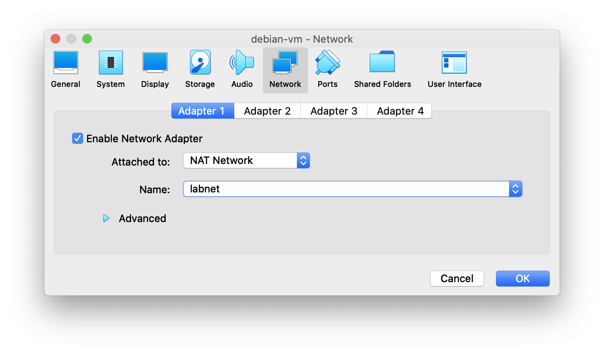

Konfiguracja i zarządzanie serwerem plików (NFS, Samba, FTP)
============================================================

## Wymagania wstępne

1. Zadania wykonywane będą przy pomocy maszyn VM2 i VM3 oraz Twojej maszyny z systemem Debian (z interfejsem graficznym).

2. Dla przypomnienia: dane logowania to `debian`/`password`, uprawnienia podnosimy przy pomocy `sudo -i`.

3. Przywróć maszyny do stanu początkowego, uruchamiając skrypt `cook-vms`.

4. Zmodyfikuj ilość pamięci RAM dla maszyn VM2 i VM3 używając polecenia:

   ```console
   vboxmanage modifyvm vm2 --memory 512

   vboxmanage modifyvm vm3 --memory 512
   ```

4. Podaj obu maszynom sieć NAT (jej adres to `10.10.10.0/24`) oraz usuń nieużywane sieci:

   ```console
   vboxmanage natnetwork add --netname labnet --network "10.10.10.0/24" --dhcp on --enable

   vboxmanage modifyvm vm2 --nic1 none

   vboxmanage modifyvm vm2 --nic2 none

   vboxmanage modifyvm vm2 --nic3 natnetwork --nat-network3 labnet

   vboxmanage modifyvm vm3 --nic1 none

   vboxmanage modifyvm vm3 --nic2 none

   vboxmanage modifyvm vm3 --nic3 natnetwork --nat-network3 labnet
   ```

5. W Twojej maszynie wirtualnej deaktywuj wszystkie adaptery sieci z wyjątkiem pierwszego, a pierwszy skonfiguruj tak, by korzystał z sieci `labnet`:

   

6. Uruchom maszyny poleceniem `start-vms` oraz uruchom Twoją maszynę wirtualną.

7. Na maszynie VM2 i VM3 skonfiguruj połączenie dodając na końcu pliku `/etc/network/interfaces.d/40-network-cfg` linię:
   ```
   iface enp0s9 inet dhcp
   ```

   a następnie wywołując polecenia

   ```console
   # ifdown enp0s9

   # ifup enp0s9
   ```

## Zadania

1. **NFS**

   a. Na maszynie VM2 zainstaluj pakiet:

      ```console
      # apt update

      # apt install -y nfs-kernel-server
      ```

   b. Sprawdź adresy obu maszyny w nowej sieci (powinna być wymieniona na końcu po wywołaniu polecenia `ip ad`).
   
   c. W pliku `/etc/idmapd.conf` skonfiguruj domenę - odkomentuj linię `# Domain = localdomain` i podaj dowolną nazwę domeny, np. `Domain = linuxlab`.

   d. Stwórz następujące foldery i plik:

      ```
      /
      |
      +-- nfs
          |
          +-- export
              |
              +-- plik.txt
      ```

      W pliku `plik.txt` umieść dowolny tekst.
    
   e. Skonfiguruj NFS modyfikując plik `/etc/exports`. Dodaj w nim poniższą linijkę, zastępując odpowiednio opcje:

      ```
      /nfs/export A.B.C.D/E(rw,sync,fsid=0,no_root_squash,no_subtree_check)
      ```

      * `/nfs/export` - udostępniany katalog
      * `A.B.C.D/E` - adres i maska podsieci pomiędzy maszynami VM1 i VM2
      * `rw` - prawo odczytu i zapisu
      * `sync` - synchronizacja
      * `no_root_squash` - nadaje uprawnienia roota
      * `no_subtree_check` - wyłącza weryfikację poddrzewa

   f. Zrestartuj usługę:
      
      ```console
      # systemctl restart nfs-server.service
      ```

      **Zamieść w raporcie zrzut ekranu ze statusu usługi:**

      ```console
      $ systemctl status nfs-server.service
      ```

   g. Na maszynie VM3 zainstaluj pakiet:

      ```console
      # apt update

      # apt install -y nfs-common
      ```

   h. Skonfiguruj domenę (jak w pkt. c.).

   i. Stwórz następujące foldery:

      ```
      /
      |
      +-- nfs
          |
          +-- import
      ```
    
   j. Zamontuj katalog export z VM2 na maszynie VM3 w katalogu import (podaj adres ip maszyny VM2 `A.B.C.G`):

      ```console
      # mount -t nfs A.B.C.G:/nfs/export /nfs/import
      ```
      
      **Zamieść w raporcie wynik wykonania polecenia.**
    
   k. Sprawdź czy katalog został zamontowany poleceniem `df -h`. Sprawdź, czy w folderze `/nfs/import` znajduje się plik `plik.txt` oraz czy zawiera tekst wpisany na maszynie VM2. **Zamieść w raporcie zrzut ekranu z wykonanych poleceń oraz zawartości pliku.**

   l. Zmodyfikuj plik `plik.txt` na maszynie VM3. Sprawdź, czy zmiana pojawiła się również na maszynie VM2.

   m. Odmontuj katalog poleceniem `umount /nfs/import`.

2. **SAMBA**

   > SAMBA to standard komunikacji pomiędzy systemami Linux oraz Windows. Pozwala w prosty i bezpieczny sposób udostępniać pliki, drukarki oraz inne serwisy.

   a. Zainstaluj na maszynie VM2 pakiet:

      ```console
      # apt install -y samba
      ```

      Jeżeli pojawi się okno z pytaniem należy wybrać `No`.

   b. Przygotuj udział:

      *  Utwórz folder `/samba`
      *  Nadaj mu uprawnienia `777`
      *  Zmodyfikuj plik `/etc/samba/smb.conf`:

         - pod `[global]` dodaj linijkę:
           
           ```
           unix charset = UTF-8
           ```
         
         - w linii 29 zmodyfikuj grupę roboczą:

           ```
           workgroup = LINUXLAB
           ```
        
         - na końcu pliku dodaj linie:
          
           ```
           [MyWinDir]
               path = /samba
               writable = yes
               guest ok = yes
               guest only = yes
               create mode = 0777
               directory mode = 0777
           ```
      
   c.  Sprawdź poprawność konfiguracji. **Zamieść zrzuty ekranu z wykonania poleceń w raporcie.**

       ```console
       $ testparm /etc/samba/smb.conf

       # systemctl restart smbd
       
       $ systemctl status smbd
       ```

   d. Na Twojej maszynie wirtualnej uruchom program Nautilus (menedżer plików). Wciśnij kombinację `Ctrl+L` aby móc wpisać adres. Następnie wpisz `smb://A.B.C.D`, gdzie  `A.B.C.D` to adres IP maszyny VM2. **Zamieść zrzut ekranu okna w raporcie.**

   e. Utwórz w folderze `MyWinDir` folder o dowolnej nazwie oraz umieść w nim dowolny plik. Sprawdź, czy pojawiły się one w folderze `/samba` na maszynie VM2. **Zamieść zrzut ekranu polecenia `ls -la` w folderze `/samba` maszyny VM2.**

3. **FTP**

   a. Zainstaluj na VM3 pakiety:

      ```console
      # apt install -y proftpd-basic openssl
      ```

   b. Utwórz w katalogu domowym (`/home/debian`) jeden plik tekstowy o dowolnej zawartości.

   b. Skonfiguruj FTP w pliku `/etc/proftpd/proftpd.conf`:
      
      *  `UseIPv6 off` (linia 11)
      *  `IdentLookups off` (linia 13)
      *  `ServerIdent on "FTP Server ready."` (nowa linia - powyżerj `ServerName` - komunikat)
      *  `DefaultRoot ~` (linia 36 - należy odkomentować, aby użytkownik został w domowym katalogu)

   c. Zrestartuj usługę poleceniem `systemctl restart proftpd.service`. Sprawdź status usługi. **Zamieść zrzut ekranu w raporcie.**

   d. Na maszynie VM2 zainstaluj klienta:
      
      ```console
      # apt install ftp
      ```
   
   e. Utwórz na masztnie VM2 plik tekstowy o dowolnej zawartości.
   
   f. Podłącz się do maszyny VM3 z VM2 przez `ftp` używając polecenia (`A.B.C.D` to adres maszyny VM3):

      ```console
      $ ftp A.B.C.D
      ```

      Podaj login i hasło użytkownika `debian`/`password`.
    
   g. Wyświetl listę plików poleceniem `ls -la` i sprawdź, czy widoczne są pliki z maszyny VM3. **Zamieść zrzut ekranu w raporcie.**

   h. Skonfiguruj ścieżkę docelową dla pobieranych plików poleceniem:

      ```console
      lcd /home
      ```
   
   i. Pobierz plik utworzony w pkt. b. używając polecenia `get`. **Zamieść zrzut ekranu z wykonanego polecenia w raporcie.**

   j. Prześlij utworzony w pkt. e. plik na maszynę VM3 używając polecenia `put`. **Zamieść zrzut ekranu z wykonanego polecenia w raporcie.**

   k. Sprawdź, czy pliki pojawiły się na obu maszynach (na VM2 w folderze `/home`, a na VM3 w folderze `/home/debian`). **Zamieść w raporcie zrzuty ekranu polecenia `ls -la` wykonanego w tych folderach.**

   l. Analogicznie jak w pkt. 2.d., w swojej maszynie wirtualnej podłącz się do serwera FTP na maszynie VM3, używając adresu `ftp://A.B.C.E`, gdzie `A.B.C.E` to adres maszyny VM3. Podaj login i hasło `debian`/`password`. **Zamieść zrzut ekranu okna w raporcie.**

   m. Skonfiguruj certyfikat SSL dla TLS na maszynie VM3:
      
      *  Utwórz folder `/etc/proftpd/ssl`
      *  Wykonaj polecenie aby utworzyć klucz:
         
         ```console
         # openssl req -new -x509 -days 365 -nodes -out /etc/proftpd/ssl/proftpd.cert.pem -keyout /etc/proftpd/ssl/proftpd.key.pem
         ```
      
      *  W pliku `/etc/proftpd/proftpd.conf` odkomentuj linię:

         ```
         Include /etc/proftpd/tls.conf (linia 140)
         ```
    
      *  Wykonaj kopię zapasową konfiguracji TLS, a następnie wyczyść plik:

         ```
         # cp /etc/proftpd/tls.conf /etc/proftpd/tls.conf_orig

         # cat /dev/null > /etc/proftpd/tls.conf
         ```
      
      *  Do pliku `/etc/proftpd/tls.conf` wprowadź następującą zawartość:

         ```
         <IfModule mod_tls.c>
         TLSEngine on
         TLSLog /var/log/proftpd/tls.log
         TLSProtocol SSLv23
         TLSOptions NoCertRequest NoSessionReuseRequired
         TLSRSACertificateFile /etc/proftpd/ssl/proftpd.cert.pem
         TLSRSACertificateKeyFile /etc/proftpd/ssl/proftpd.key.pem
         TLSVerifyClient off
         TLSRequired on
         </IfModule>
         ```
      
      *  Uruchom ponownie usługę poleceiem:

         ```console
         # systemctl restart proftpd.service
         ```
     
      *  Sprawdź status usługi. **Umieść zrzut ekranu w raporcie.**

         ```console
         $ systemctl status proftpd.service
         ```
   
   n. Powtórz punkty f.-l. używając polecenia `sftp`.

## Literatura:

 * `man`:
   * `ftp`, `sftp`
 * slajdy z wykładu nr 11
